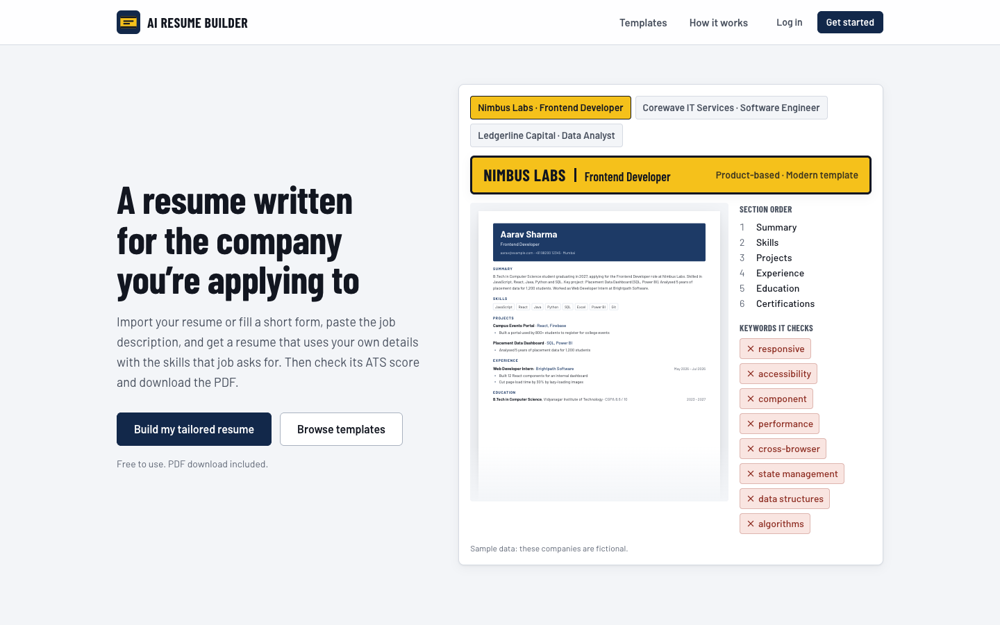
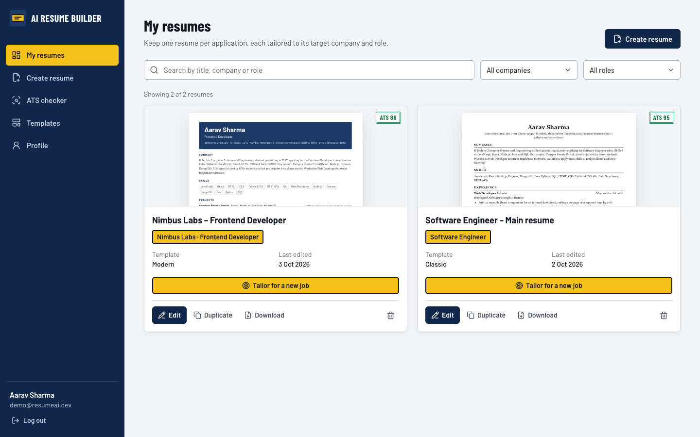
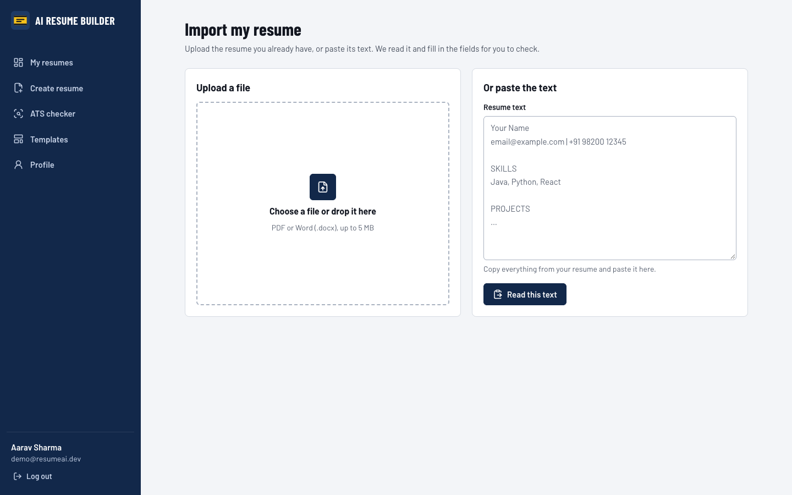
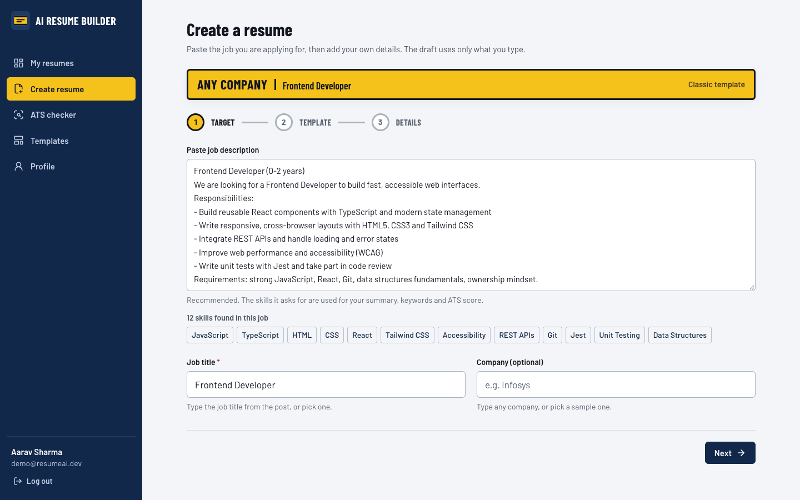
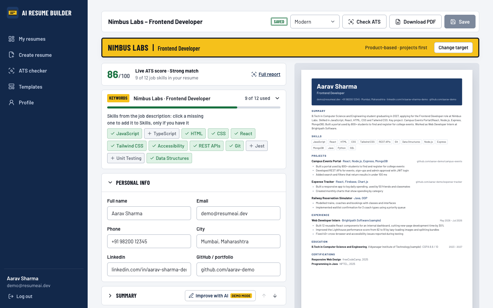
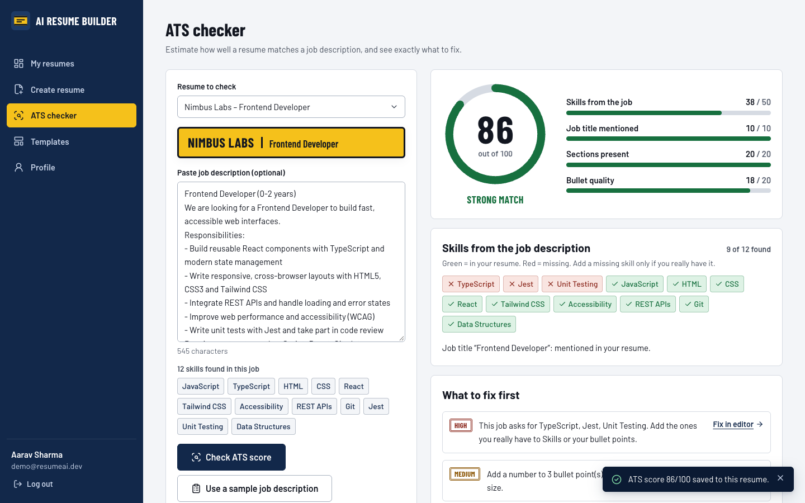
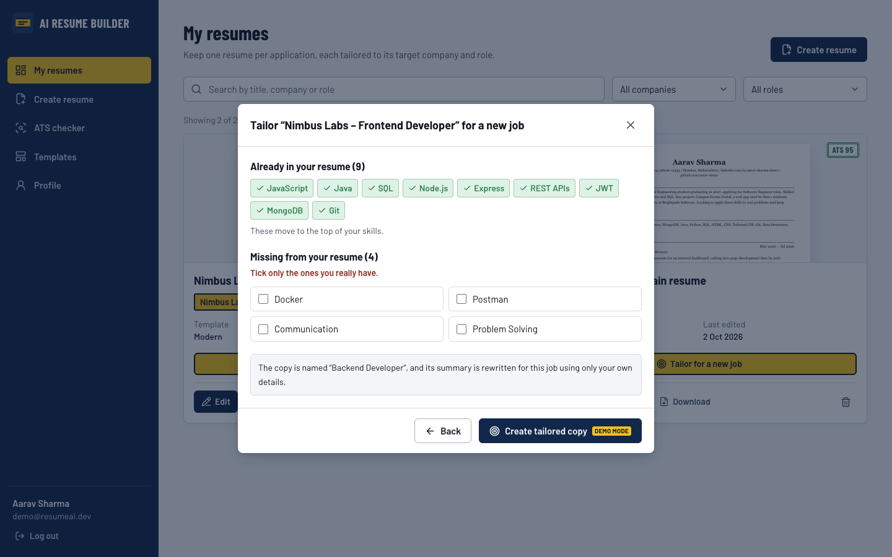
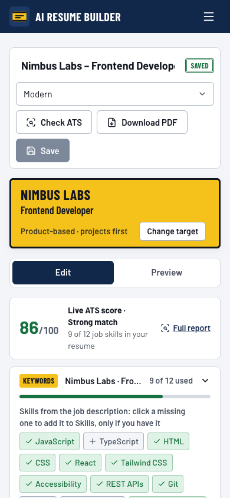

# AI Resume Builder

A MERN stack web app that helps students and freshers make **ATS-friendly resumes for a specific job**.
You import your resume (or fill a short form), paste the job description, and the site builds a resume from
**your own details** with the skills that job asks for. Then you check its ATS score and download a PDF.

> **Current phase: frontend.** The React frontend is complete and works fully in the browser. The Node.js +
> Express + MongoDB backend and the real AI model come in later phases (see [Roadmap](#roadmap)).



---


## Problem statement

Many job seekers face difficulties in creating professional and ATS-friendly resumes due to limited knowledge of
resume formats, industry requirements, and job-specific skills. Traditional resume builders provide general
templates that may not match the expectations of different companies and job roles. Creating a customized resume
for each company and position is time-consuming and requires proper understanding of required keywords and formats.
Therefore, there is a need for an AI-powered Resume Builder that can generate, customize, and optimize resumes based
on specific companies, industries, and job roles while improving ATS compatibility and overall resume quality.

## Objectives

| # | Objective |
|---|---|
| O1 | Develop an AI-powered Resume Builder using the MERN Stack that generates professional, ATS-friendly resumes. |
| O2 | Enable users to create resumes tailored to specific companies and job roles by entering the target company and position. |
| O3 | Use AI along with collected company-specific resume data to generate customized resume content that aligns with employer expectations. |
| O4 | Provide customizable resume templates, real-time editing, preview, and PDF download features. |
| O5 | Reduce the time and effort required to create high-quality resumes while improving shortlisting chances through ATS-compatible, role-focused resumes. |
| O6 | Provide a secure and user-friendly platform for storing, managing, and updating multiple resumes. |

## Features

| Feature | What it does |
|---|---|
| **Import a resume** | Upload a PDF or Word (.docx) file, or paste the text. Name, email, phone, LinkedIn, summary, skills, experience, projects, education and certifications are filled in. You check and correct them before editing. Scanned PDFs show a clear message. |
| **Three ways to start** | "Create resume" offers: Import my resume, Fill a form, or Start blank. |
| **Paste a job description** | The site finds the skills the job asks for (about 130 skills, with short forms like JS = JavaScript, k8s = Kubernetes) and shows them as chips. |
| **Create form** | Your own skills, projects and internships. "Generate" uses only what you typed: it turns your sentences into bullet points and writes a 40–80 word summary. |
| **Resume editor** | Edit every section with a live A4 preview, a live ATS score, and the job's skills (green = in your resume, grey = missing; click one to add it). |
| **ATS checker** | Score out of 100 with matched and missing skills, fixes ranked by importance with "Fix in editor" links, and a "How this score works" box. |
| **Tailor for a new job** | Make a copy of any resume for a new job description. Matching skills move to the top, the summary is rewritten, and you tick only the missing skills you really have. The original stays unchanged. |
| **Templates and PDF** | Classic, Modern and Minimal templates. Downloads a text-based PDF that ATS systems can read. |
| **Accounts and dashboard** | Sign up, log in, profile, and a dashboard of all your resumes (edit, duplicate, download, delete, search). |
| **Admin** | Manage templates, sample companies and roles; see totals; reset the demo data. |
| **Form validation** | Mobile numbers (+91, 10 digits), CGPA out of 10 or percentage with %, years, dates, links and passwords, with errors shown as you fill the form. |

## What is real and what is demo mode

| Part | Status now |
|---|---|
| Import from PDF / Word / text | **Real.** Text is read in the browser with `pdfjs-dist` and `mammoth`, then split into sections with simple rules. |
| Skills found in a job description | **Real.** Whole-word matching against the skills list (`client/src/data/skillsList.js`). |
| ATS score | **Real calculation**, explained on the results page. It is an estimate like Jobscan; real ATS systems differ. |
| Editor, preview, PDF, validation, tailoring | **Real.** |
| "Generate", "Improve with AI", tailored summary | **Demo mode.** Written rules, not an AI model: they clean up and rearrange only what you typed and never add new facts. Every AI button has a "Demo mode" badge. |
| Accounts and saved resumes | **Demo mode.** Saved in your browser (`localStorage`), so they stay on one device. |

### How the ATS score works

| Part | Points |
|---|---|
| Skills from the job description found in the resume | 50 |
| Job title mentioned in the summary or experience | 10 |
| Sections present: contact, summary, skills, projects or experience, education | 20 (4 each) |
| Bullet quality: bullets with numbers (8), bullets starting with an action verb (8), summary of 40–80 words (4) | 20 |

Without a job description, only sections and bullet quality are checked and the result is shown out of 100.
The logic is in one function, `calculateAtsScore()` in `client/src/utils/atsScore.js`.

## How the AI part will be connected (Phase 3)

All AI work goes through four functions in `client/src/services/aiService.js`:

| Function | What it does |
|---|---|
| `generateBullets(text, jobDescription)` | Turns the user's sentences into bullet points |
| `writeSummary(profile, jobDescription)` | Writes a 40–80 word summary from the user's own details |
| `improveSection(section, content, jobDescription)` | Rephrases one section without adding facts |
| `tailorSummary(resume, jobDescription)` | Rewrites the summary for a new job |

Pages never contain AI logic; they only call these functions. In Phase 3, only the inside of each function
changes: it will call our Express backend (for example `POST /api/ai/summary`), and the backend will call a real
AI model. The API key stays on the server, because a key in frontend code can be seen by anyone.

## Tech stack

| Layer | Now | Later phases |
|---|---|---|
| Frontend | React 19 + Vite, plain JavaScript, React Router, Tailwind CSS, Context API | same |
| File reading | pdfjs-dist (PDF), mammoth (Word .docx) | same |
| PDF download | react-to-print (browser print, keeps real text) | same |
| Data | Browser `localStorage` through the services in `client/src/services` | MongoDB |
| API | Service functions that return Promises | Node.js + Express REST API |
| AI | Rule-based demo in `aiService.js` | AI model called from the backend |

## Folder structure

```
ai-resume-builder/
├── client/                     React frontend
│   ├── vercel.json             lets page links work on Vercel
│   └── src/
│       ├── pages/              one file per page (Dashboard, Create, Import, Editor, ATS checker …)
│       ├── components/         shared UI, plus editor/, wizard/, ats/, landing/, admin/, templates/
│       ├── services/           aiService (AI functions), atsService, resumeService, authService …
│       ├── utils/              atsScore, jobDescription, resumeImport, validation, keywordUtils …
│       ├── data/               skillsList, sample resumes, companies, roles, templates, job descriptions
│       └── context/            logged-in user, resumes, catalog, toasts
├── server/                     backend (Phase 2)
└── docs/screenshots/
```

## How to run

Requirements: Node.js 20 or newer.

```bash
git clone https://github.com/suiishiii67/ai-resume-builder.git
cd ai-resume-builder/client
npm install
npm run dev
```

Open http://localhost:5173.

| Command (inside `client/`) | What it does |
|---|---|
| `npm run dev` | Start the app for development |
| `npm run build` | Production build into `client/dist` |
| `npm run lint` | Check the code with ESLint |

### Deploy on Vercel

Import the GitHub repo in Vercel, set **Root Directory** to `client`, and deploy. Vercel detects Vite
automatically; `client/vercel.json` makes links like `/dashboard` work when the page is refreshed.

## Demo accounts

| Account | Email | Password |
|---|---|---|
| User | `demo@resumeai.dev` | `demo1234` |
| Admin | `admin@resumeai.dev` | `admin1234` |

The demo user has a complete B.Tech CSE fresher resume and a copy tailored for a Frontend Developer job.
**Admin → Reset demo data** brings the sample data back. Company names in the sample data are made up.

## Screenshots

| | |
|---|---|
|  Dashboard |  Import a resume |
|  Paste a job description |  Editor with live score |
|  ATS checker |  Tailor for a new job |



## Roadmap

| Phase | Scope | Status |
|---|---|---|
| Phase 1 | Frontend: all pages, import, job description matching, ATS score, tailoring | **Done** |
| Phase 2 | Backend: Node.js + Express REST API, MongoDB, real login (bcrypt, JWT) | Planned |
| Phase 3 | Real AI model behind `aiService.js`, called from the backend | Planned |
| Phase 4 | Testing and deployment | Planned |
