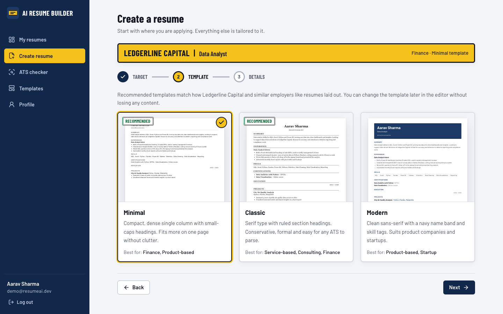
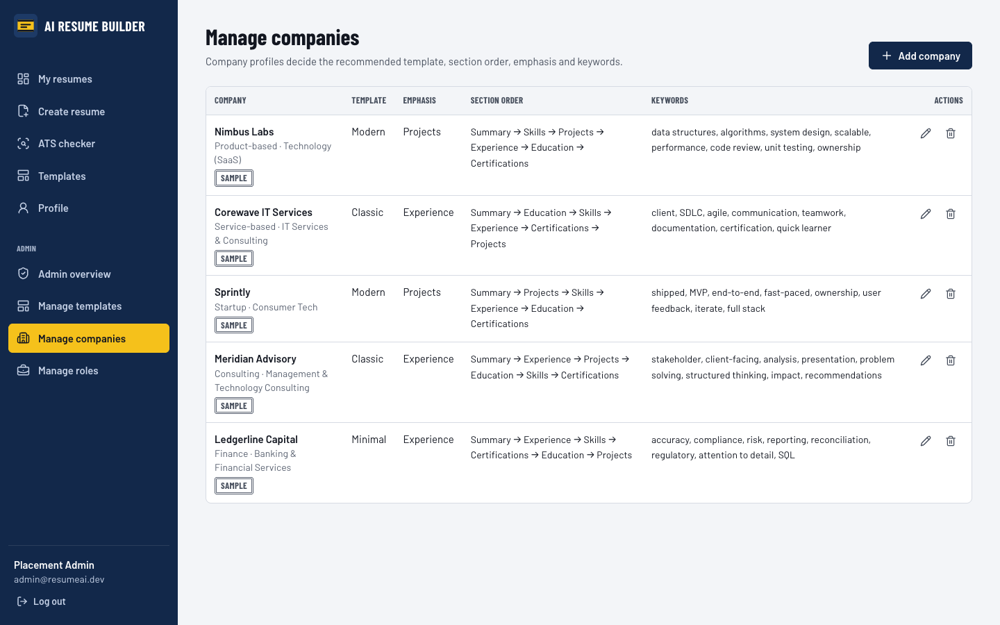

# AI Resume Builder

A MERN stack web app that builds **ATS-friendly resumes tailored to a specific target company and job role**.
The user enters the company and role first; the recommended template, the AI-written draft, the section order,
the keyword suggestions and the ATS check all follow that choice.

> **Phase 1 (Review 1): frontend + GitHub repository.** The React frontend is complete and runs on mock data
> through a mock service layer. The Node.js/Express/MongoDB backend and real AI integration come in later phases.
> Every place that will call the backend is marked `// TODO (Phase 2): replace mock with real API call to the Express backend`.


---

## Problem statement

Many job seekers face difficulties in creating professional and ATS-friendly resumes due to limited knowledge of
resume formats, industry requirements, and job-specific skills. Traditional resume builders provide general
templates that may not match the expectations of different companies and job roles. Creating a customized resume
for each company and position is time-consuming and requires proper understanding of required keywords and formats.
Therefore, there is a need for an AI-powered Resume Builder that can generate, customize, and optimize resumes based
on specific companies, industries, and job roles while improving ATS compatibility and overall resume quality.

## Objectives

| # | Objective |
|---|---|
| O1 | Develop an AI-powered Resume Builder using the MERN Stack that generates professional, ATS-friendly resumes. |
| O2 | Enable users to create resumes tailored to specific companies and job roles by entering the target company and position. |
| O3 | Use AI along with collected company-specific resume data to generate customized resume content that aligns with employer expectations. |
| O4 | Provide customizable resume templates, real-time editing, preview, and PDF download features. |
| O5 | Reduce the time and effort required to create high-quality resumes while improving shortlisting chances through ATS-compatible, role-focused resumes. |
| O6 | Provide a secure and user-friendly platform for storing, managing, and updating multiple resumes. |

How each objective and deliverable maps to pages and files: see the traceability table in
[docs/CODE_GUIDE.md](docs/CODE_GUIDE.md).

## Features (Phase 1)

- **Target first:** the create wizard starts with the target company and job role (autocomplete or custom entry) and shows what that company looks for.
- **Company and role based customisation:** 5 sample companies and 6 roles; each company sets the recommended template, section order, emphasis (projects or experience) and keywords.
- **AI resume generation (mock):** "Generate with AI" writes a tailored first draft; "Improve with AI" rewrites one section, with Undo.
- **Resume editor:** section forms with add/remove entries and section reordering, a **live A4 preview**, a keyword panel for the target, template switching that keeps the content, "Change target", and Edit/Preview tabs on phones.
- **PDF download:** prints a text-based A4 PDF (no images of text), so applicant tracking systems can read it.
- **ATS checker:** score out of 100 with a circular progress ring, a formula breakdown, matched and missing keywords, section checks and prioritised suggestions with "Fix in editor" links.
- **Templates gallery:** Classic, Modern and Minimal single-column ATS-safe templates, filterable by industry, company type and role.
- **User dashboard:** resume cards with mini previews, target, template, last edited date and ATS stamp; Edit, Duplicate, Download, Delete (with confirmation); search and filters; empty state.
- **Authentication (mock):** signup and login with validation, password show/hide, protected routes, profile editing and password change.
- **Admin dashboard:** totals, resumes per company, latest resumes, and add/edit/delete for templates, companies and roles. Changes show up immediately in the wizard, editor and ATS checker.
- **Responsive** from 360 px phones to desktop, keyboard accessible, labelled form fields.

## Tech stack

| Layer | Phase 1 (now) | Later phases |
|---|---|---|
| Frontend | React 19 + Vite, plain JavaScript, React Router, Tailwind CSS, Context API | same |
| PDF | react-to-print (browser print, keeps a real text layer) | same |
| Icons and fonts | lucide-react, self-hosted Barlow and Barlow Condensed | same |
| Data | Mock data in `client/src/data`, saved in `localStorage` | MongoDB |
| API | Mock services in `client/src/services` (Promises with a short delay) | Node.js + Express REST API |
| AI | Template-based mock in `aiService.js` | AI model called from the backend |

## Folder structure

```
ai-resume-builder/
├── client/                    React frontend (this phase)
│   ├── index.html
│   ├── vite.config.js
│   └── src/
│       ├── main.jsx           entry point
│       ├── App.jsx            router + context providers
│       ├── index.css          design tokens and global styles
│       ├── routes/            AppRoutes, ProtectedRoute, AdminRoute, ScrollToTop
│       ├── context/           AuthContext, ResumeContext, CatalogContext, ToastContext
│       ├── services/          authService, resumeService, aiService, atsService,
│       │                      catalogService, adminService   (mock API layer)
│       ├── data/              companies, roles, templates, sampleResumes, users,
│       │                      sampleJobDescriptions, sections   (sample data)
│       ├── utils/             atsScore, keywordUtils, validation, storage, targetProfile,
│       │                      resumeFormat, pdf, mockApi, scoreBand, listText
│       ├── components/        shared UI (Button, Input, Navbar, Sidebar, ResumeCard,
│       │   │                  TargetStrip, ScoreCircle, Modal, Toast, EmptyState …)
│       │   ├── templates/     ClassicTemplate, ModernTemplate, MinimalTemplate,
│       │   │                  TemplateRenderer, ResumePreview
│       │   ├── editor/        section forms, KeywordPanel, EditorToolbar, RetargetDialog …
│       │   ├── wizard/        StepTarget, StepTemplate, StepBasics, CompanyInsight …
│       │   ├── ats/           AtsResultPanel, ScoreBreakdown, KeywordResults …
│       │   ├── landing/       HeroDemo, FeatureIndex, RouteSteps, AtsTeaser
│       │   └── admin/         DataTable, CompanyForm, RoleForm, TemplateForm …
│       └── pages/             one file per page (+ pages/admin/)
├── server/                    README only: backend comes in Phase 2
├── docs/                      code guide, research, architecture, design system,
│                              Phase 2 placeholders (SRS, ER, DFD), screenshots
└── README.md
```

## Setup

Requirements: Node.js 20 or newer and npm.

```bash
git clone https://github.com/suiishiii67/ai-resume-builder.git
cd ai-resume-builder/client
npm install
npm run dev
```

Open the address Vite prints (usually http://localhost:5173).

Other scripts (run inside `client/`):

| Command | What it does |
|---|---|
| `npm run build` | Production build into `client/dist` |
| `npm run preview` | Serve the production build locally |
| `npm run lint` | Check code quality with ESLint |

## Demo credentials

| Account | Email | Password | Notes |
|---|---|---|---|
| User | `demo@resumeai.dev` | `demo1234` | Has 3 sample resumes for 3 different targets |
| Admin | `admin@resumeai.dev` | `admin1234` | Opens the admin dashboard |

The login page also has "Fill demo user" and "Fill admin" buttons. All data is stored in the browser.
**Admin overview → Reset demo data** restores the original sample data.

All company names (Nimbus Labs, Corewave IT Services, Sprintly, Meridian Advisory, Ledgerline Capital) are
**fictional sample data**.

## Screenshots

| | |
|---|---|
|  Dashboard |  Wizard: target company + role |
|  Wizard: recommended templates |  Editor with live preview |
|  ATS checker |  Admin: manage companies |


## Roadmap

| Phase | Scope | Status |
|---|---|---|
| Phase 1 | Frontend (React, all pages, mock services) + GitHub repository | **Done** |
| Phase 2 | Backend: Node.js + Express REST API, MongoDB, real authentication (bcrypt, JWT), SRS, ER diagram, DFD, system architecture | Planned |
| Phase 3 | AI integration for generation and improvement, server-side ATS engine | Planned |
| Phase 4 | Testing (unit, integration, UAT, reports) and deployment | Planned |

## Documentation

- [docs/CODE_GUIDE.md](docs/CODE_GUIDE.md): viva guide, with traceability, a feature-to-file table and explanations
- [docs/FRONTEND_ARCHITECTURE.md](docs/FRONTEND_ARCHITECTURE.md): how the frontend is organised
- [docs/DESIGN_SYSTEM.md](docs/DESIGN_SYSTEM.md): colours, type and components
- [docs/REFERENCE_RESEARCH.md](docs/REFERENCE_RESEARCH.md): user-flow research and the patterns we adopted
- Phase 2 placeholders: [SRS](docs/SRS.md), [ER diagram](docs/ER-Diagram.md), [DFD](docs/DFD.md), [System architecture](docs/System-Architecture.md)
